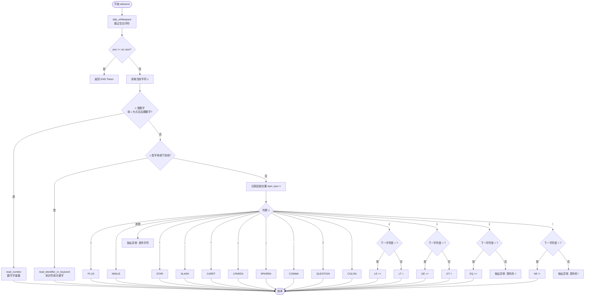
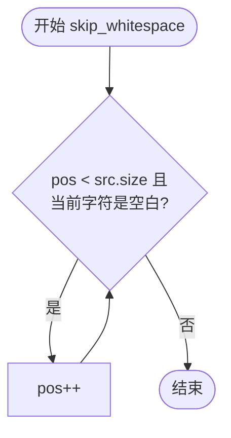
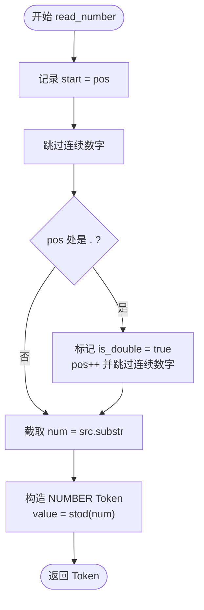
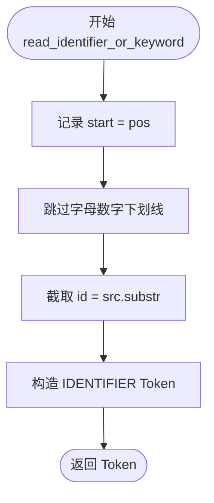

明白了，问题出在 Mermaid 9.1.2 对节点标签中特殊字符（如 `(`、`)`）的解析有严格限制。以下是兼容 9.1.2 版本的修正流程图，将所有特殊字符用引号包裹或改用中文描述：

---

### 子流程：`skip_whitespace`

---

### 子流程：`read_number`

---

### 子流程：`read_identifier_or_keyword`

---

（兼容 Mermaid 9.1.2）
