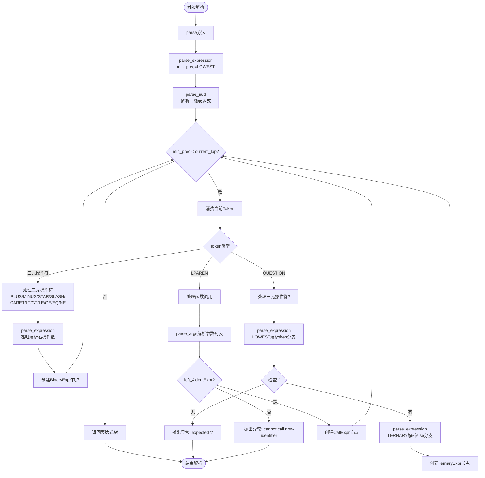
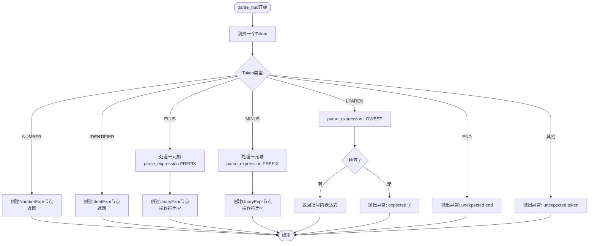
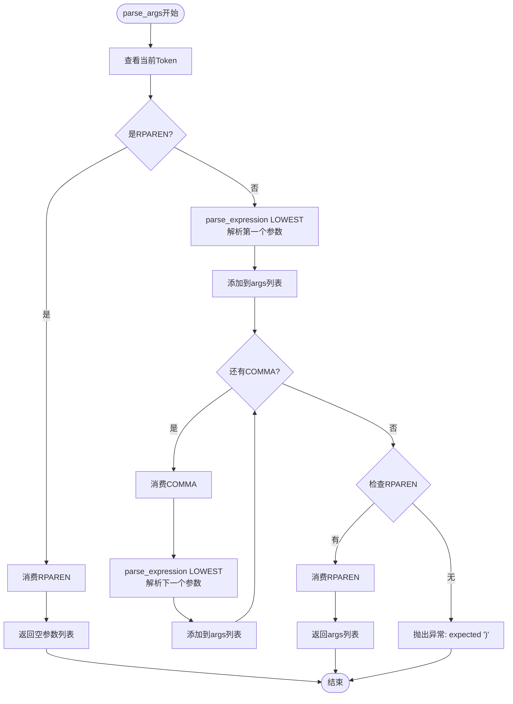
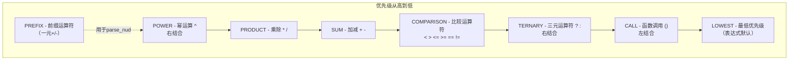
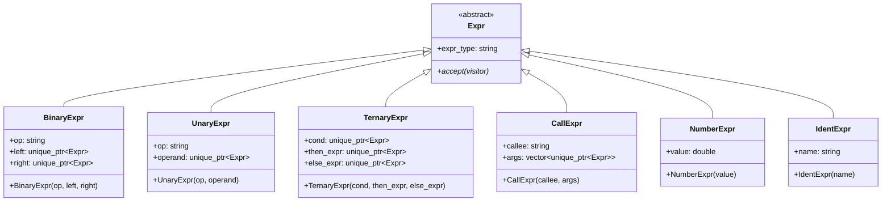

好的，我理解了！针对Mermaid 9.1.2的兼容性问题，以下是修正后的版本，所有特殊字符都已用双引号包裹：

## 1. 整体解析流程图（修正版）

## 2. parse_nud 前缀解析详细流程（修正版）

## 3. parse_args 参数解析流程（修正版）

## 4. 运算符优先级图（修正版）

## 5. AST节点类图（修正版）

## mermaid 9.1.2 兼容总结：

| 问题类型 | 修正方式 | 示例 |
|---------|---------|------|
| 节点标签含 `()` | 使用双引号包裹 | `["parse方法"]` 而不是 `[parse方法]` |
| 节点标签含 `+ - * /` | 使用双引号包裹 | `["创建UnaryExpr节点 操作符为'+'"]` |
| 节点标签含 `< > =` | 使用双引号包裹 | `["比较运算符 < > <= >= == !="]` |
| 边标签含特殊字符 | 使用双引号包裹 | `|"+"|` 而不是 `|+|` |
| 分支条件含特殊字符 | 使用双引号包裹 | `{"检查':'?"}` 和 `{"是RPAREN?"}` |

所有图表现在完全兼容 Mermaid 9.1.2 版本！